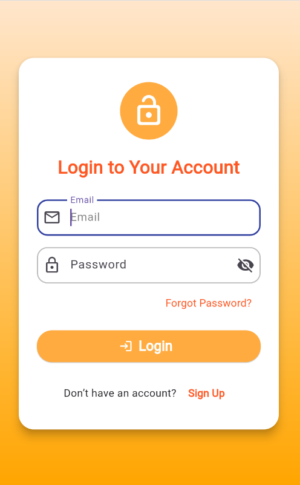
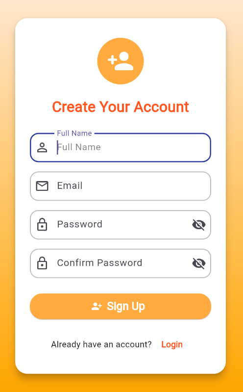
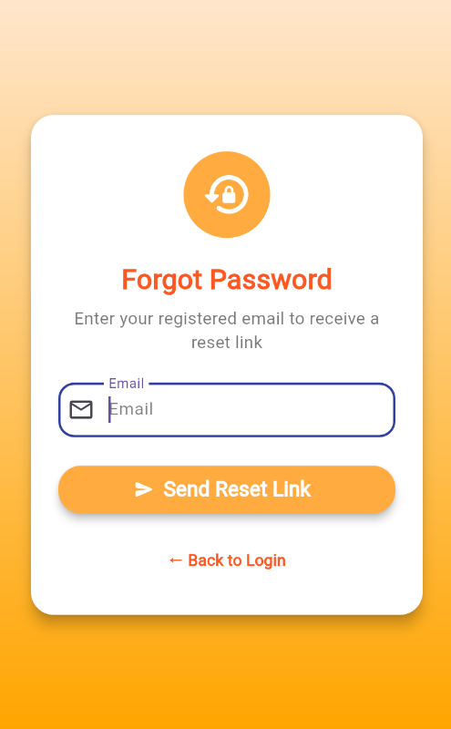

# 🔐 SecureLoginPage  

A Flutter project with **Login**, **Sign-Up**, and **Forgot Password** screens using **GetX** for clean and efficient state management.

---

## 📸 Screenshots

## 📸 Screenshots

| Login | Sign Up | Forgot Password |
|--------|----------|----------------|
|  |  |  |


---

## ⚙️ Features
- Simple and modern UI design  
- GetX for state management  
- Email and password validation  
- Remember Me functionality  
- Separate controller and UI files  

---

## 🚀 How to Run
```bash
git clone https://github.com/<your-username>/SecureLoginPage.git
cd SecureLoginPage
flutter pub get
flutter run
